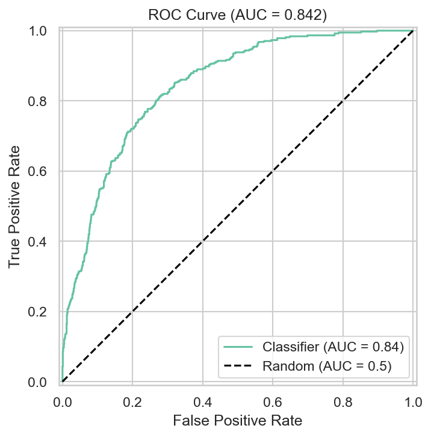
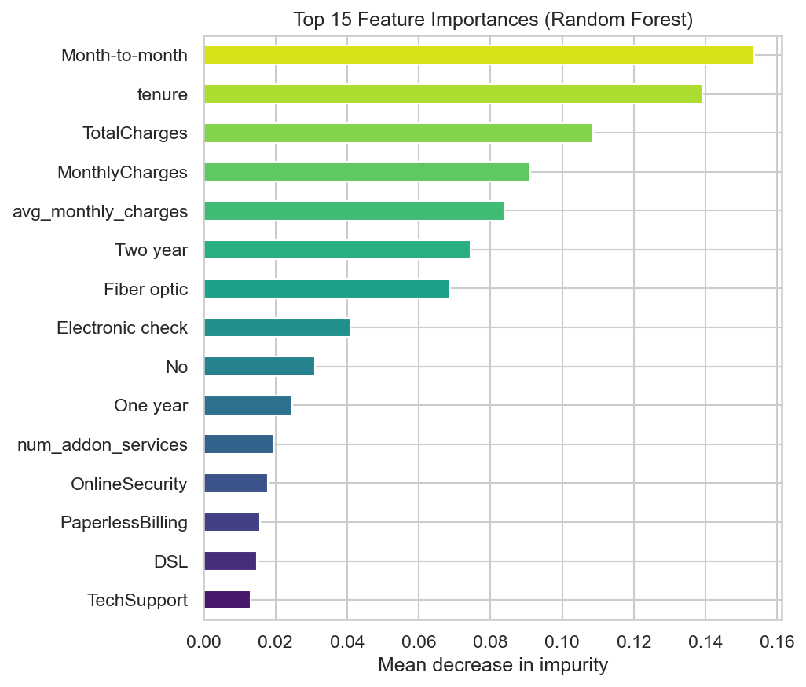

<div align="center">

# 📡 Customer Churn Prediction System

**A production-style end-to-end ML project that predicts telecom customer churn — from raw data to a deployed interactive dashboard.**

[](https://www.python.org/)
[](https://scikit-learn.org/)
[](https://pandas.pydata.org/)
[](https://streamlit.io/)
[](LICENSE)

**Key result: Holdout ROC-AUC 0.842 · Recall 0.81 at optimal threshold**

</div>

---

## 🚀 Live demo

> Deploy it for free in ~5 minutes on [Streamlit Community Cloud](https://streamlit.io/cloud) — see [Deployment](#deployment).

## 📌 Table of contents

- [Overview](#overview)
- [Business problem](#business-problem)
- [Tech stack](#tech-stack)
- [Pipeline](#pipeline)
- [Project structure](#project-structure)
- [Getting started](#getting-started)
- [Model performance](#model-performance)
- [Deployment](#deployment)
- [Sharing on LinkedIn](#sharing-on-linkedin)
- [Roadmap](#roadmap)

---

## Overview

This project solves a classic **customer retention** problem: given a telecom
customer's profile (contract, tenure, services, charges, payment method...),
predict whether they will **churn** (leave the company). Churn detection lets
retention teams act *before* revenue is lost.

It is built as a **modular, reproducible pipeline** — each stage is a reusable
Python module — and ships with a polished **Streamlit dashboard** for live
scoring and exploration.

## Business problem

| | |
|---|---|
| **Question** | Will this customer churn? |
| **Target** | `Churn` — Yes / No |
| **Dataset** | IBM Telco Churn — 7,043 customers, 21 attributes |
| **Class balance** | 26.5% churn (imbalanced) |
| **Why it matters** | Acquiring a customer costs **5–7× more** than retaining one |

The model returns a **churn probability**, a **risk band** (Low / Medium / High)
and **targeted retention recommendations** for each customer.

## Tech stack

`Python` · `Pandas` · `NumPy` · `Scikit-learn` · `Matplotlib` · `Seaborn` · `Streamlit` · `Joblib`

## Pipeline

```
data_loader.py → preprocessing.py → feature_engineering.py
              → train_model.py → evaluate.py → predict.py → app.py
```

1. **Load & validate** raw data (`src/data_loader.py`)
2. **Clean** — drop IDs, fix dtypes, handle missing values, deduplicate (`src/preprocessing.py`)
3. **Engineer features** — simplify service columns, add `num_addon_services`, `avg_monthly_charges`, `tenure_group`, one-hot encode (`src/feature_engineering.py`)
4. **Train** — stratified split, `StandardScaler`, Random Forest tuned with 5-fold cross-validation on ROC-AUC (`src/train_model.py`)
5. **Evaluate** — metrics, confusion matrix, ROC / PR curves, feature importance → PDF report (`src/evaluate.py`)
6. **Predict** — single & batch scoring reusing the exact training transforms (`src/predict.py`)
7. **Serve** — Streamlit dashboard (`app.py`)

## Project structure

```
customer-churn-prediction/
│
├── data/
│   ├── raw/telecom_churn.csv          # raw dataset (7,043 rows)
│   └── processed/                     # clean_data.csv, features.csv, splits
│
├── notebooks/
│   └── 01_EDA.ipynb                   # exploratory data analysis
│
├── src/
│   ├── data_loader.py                 # load + validate datasets
│   ├── preprocessing.py               # cleaning pipeline
│   ├── feature_engineering.py         # derived features + encoding
│   ├── train_model.py                 # CV tuning + training
│   ├── evaluate.py                    # metrics + PDF report
│   └── predict.py                     # single / batch prediction
│
├── models/                            # random_forest.pkl, scaler.pkl, config
├── reports/                           # figures + model_report.pdf
├── .streamlit/config.toml             # app theme & server settings
├── app.py                             # Streamlit dashboard (5 pages)
├── requirements.txt
└── README.md
```

## Getting started

### 1. Clone & setup

```bash
git clone https://github.com/<your-username>/customer-churn-prediction.git
cd customer-churn-prediction

python -m venv .venv
source .venv/bin/activate        # Windows: .venv\Scripts\activate

pip install -r requirements.txt
```

### 2. Run the full pipeline

```bash
python -m src.data_loader         # validate the raw dataset
python -m src.preprocessing       # → data/processed/clean_data.csv
python -m src.feature_engineering # → data/processed/features.csv + config
python -m src.train_model         # → models/random_forest.pkl + scaler.pkl
python -m src.evaluate            # → reports/figures + model_report.pdf
```

### 3. Launch the dashboard

```bash
streamlit run app.py
```

Open [http://localhost:8501](http://localhost:8501) 🎉

## Model performance

Evaluation on a **1,405-customer holdout** (never seen during training):

| Metric | Default (0.5) | Optimal (0.41) |
|---|---|---|
| Accuracy | 0.774 | 0.745 |
| Precision | 0.557 | 0.512 |
| Recall | 0.729 | **0.815** |
| F1-score | 0.631 | 0.629 |
| **ROC-AUC** | **0.842** | 0.842 |
| PR-AUC | 0.658 | 0.658 |

**Notes**
- **Imbalance handled** with `class_weight='balanced'` + ROC-AUC scoring.
- The **optimal threshold** (Youden's J) trades a little precision for much
  higher recall — for churn, *missing* an at-risk customer costs more than a
  false alert.
- **Top churn drivers**: short tenure, month-to-month contracts, fiber-optic
  internet, electronic-check payment, missing online-security / tech-support add-ons.




## Deployment

Free hosting with **Streamlit Community Cloud**:

1. **Push to GitHub**
   ```bash
   git init
   git add .
   git commit -m "Initial commit: customer churn prediction system"
   git remote add origin https://github.com/<your-username>/customer-churn-prediction.git
   git push -u origin main
   ```
   > Model artifacts, datasets and figures are committed on purpose so the
   > deployed app works immediately.

2. **Deploy**
   - Go to [share.streamlit.io](https://share.streamlit.io) and sign in with GitHub
   - **New app** → pick your repo, branch `main`, file `app.py`
   - Hit **Deploy** — done ✅

3. **Optional polish**
   - Add your repo under **Settings → Manage app** to rename it (e.g.
     `customer-churn-prediction.streamlit.app`)
   - Enable HTTPS (automatic) and share the public URL.

## Sharing on LinkedIn

After deploying, post the **live app URL** plus your GitHub repo. Suggested post:

> 🚀 Just shipped a full end-to-end machine-learning project: **Customer Churn
> Prediction**.
>
> 🔍 **Problem:** predict which telecom customers will leave, so retention teams
> can act before revenue is lost.
>
> ⚙️ **Stack:** Python, Pandas, scikit-learn, Streamlit — modular pipeline from
> raw data → tuned Random Forest (5-fold CV, ROC-AUC **0.842**) → live dashboard.
>
> 📊 **Highlights:** explainable feature importance, Youden's optimal threshold
> boosting recall to 0.81, and a polished Streamlit app for real-time risk scoring.
>
> 🔗 Live app: `<your-app-url>`
> 💻 Code: `github.com/<your-username>/customer-churn-prediction`
>
> #MachineLearning #DataScience #Python #Streamlit #CustomerChurn #Portfolio

## Roadmap

- [ ] Hyperparameter tuning comparison (XGBoost / Logistic Regression baselines)
- [ ] Batch CSV upload for scoring many customers
- [ ] SHAP-based explanations per customer
- [ ] EDA notebook `01_EDA.ipynb`

---

<div align="center">

**Built with Python & ❤️ — a professional portfolio project**

</div>
